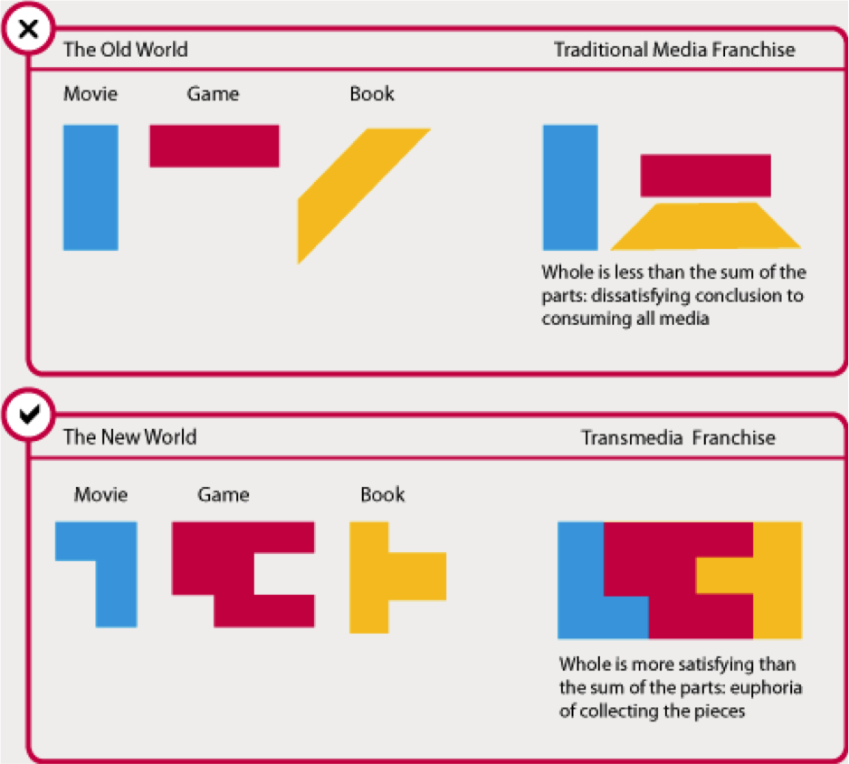

# Session 1

### Today, Tuesday 9th January

1. Welcome
2. Launching your project brief
3. Lecture: Introducing Trans-media
4. Workshop: Ideation

### Your [homework](#homework) and [blog](#blog)!

# Welcome

### Rules of the road

* **Be present**. If you happen to be late or absent, make sure you email me about it before a session starts. Otherwise do not enter until the break.
* **Participate** in class debates and workshops. We'll make sure that your ideas have space to be heard and that nobody makes you feel uncomfortable about sharing them.
* **Present** your work during formative and summative assessments. If you can't make it those days then you'll record your presentation and upload it to YouTube (or similar).
* **Be responsible** for what happens in class. Organise with your peers to get class information and material that you may have missed.
* **Meet the deadlines**. If you submit your work after a deadline, your grade will be capped.
* **Blog weekly**
* **Study at home**, otherwise you will not be able to reach the expected learning.

### How much time am  I meant to spend on this project?

# Launching your project brief for term 2

The first half of the unit explores the history and formats of storytelling, looking at some of the best examples of narrative located in a variety of forms: oral storytelling, the novel, performance, the triptych, cartoons, television, and viral content online. Students will be invited to take some of these examples and create their own non-linear narratives. Over the weeks of the course, students will be expected to participate in seminary discussions during lectures, group workshops, and to present their own examples and ideas.
Students will work together in groups (three or four people per group) to create a compelling original interactive story together that is expressed via a Web interface. Or they can adapt an existing story in this way as an interactive narrative.

Over the course of the initial weeks each student within a group will develop the online persona of a character in the drama – for example creating a twitter feed, audio, photo and video uploads of their lives through the period of the drama. These materials will then be created online and will be accessed by the audience through a central Hub web page designed using the Twine interactive narrative system.

The aim will be to create an interactive narrative or augmented reality game (ARG)-type story that can be of any style or genre that groups choose (ie it can be a noire piece, comedy, a psychological thriller, a contemporary western or a combination of all four). Students will be asked to write in character, respond to one another’s blog and online entries, make short verite films and recordings, and load pictures which combined will help tell the story.

**What do you think this means? Let's discuss!**

### Marking critera

[Link to PDF outlining the marking matrix](assets/UG-Marking-Criteria-Matrix-with-Letter-Grades.pdf)

**You will be marked on these parts of your deliverables in particular:**
* Research pack (Narrative, character, Peer-learning mini-lessons)
* Blog-posts
* Presentation
* Meta-narrative description (Plot, narrative, context, genre, character)
* Your Twine production
* 500 word reflective report

**What do you think this means? Let's discuss!**

### Learning outcomes for this project:

**Covered mainly in term 2:**
* An in-depth understanding of the development of storytelling and narrative structures including the main theoretical perspectives associated with narrative structure and storytelling and an awareness of the importance of storytelling to communities and cultures.

* The ability to construct a compelling and sophisticated narrative that also contains mood, structure, characterisation and that may involve the active participation of the audience, reader, listener or engager.

* A detailed understanding of how to construct and maintain stories that span multiple delivery formats simultaneously.

**Covered mainly in term 3:**
* An understanding of how children consume online media; knowledge of the professional considerations of making content for children (technical, physical, cognitive, societal, cultural, regulatory and ethical).

* Understanding the history of play and games culture; understanding the value of the creative use of play for serious purposes; a knowledge of the ways gaming and playful activities are being used economically and culturally by businesses, government, education and other sectors.

* An understanding of the tools and techniques available to businesses for creating games and interactive experiences for entertainment or educational purposes.

**What do you think this means? Let's discuss!**

#### In a nutshell, leading up to the formative you will:
1. Learn about creating stories
2. Learn about creating characters
3. Learn about weaving different media into an interactive story
4. Create a story and cast
5. Create online avatars for them.
6. Using Facebook, Flickr, Audio Boo, Vimeo, Blogger, Twitter, websites, etc
7. Over three next weeks you will basically create the basis of your story

# Lecture: Introducing Trans-media

### What is Trans-media?

> ‘The art of storytelling now requires the creation of
a complex story structure: multi-layered, open-ended,
and involving multiple users. Storytelling today is almost
like designing a wicked problem itself.’ Jörgen Van Der Sloot

* All media are equal
* All media work together to tell the story
* Each type of media presents its own unique viewpoint
* Rich media world - work together to create their own universe...
* Not an adaptation
* Doesn’t just re-tell the same story
* Transmedia: you only get the full story by consuming all the media.
* Picture, text, film, audio, updates, blogs, characters n Fit together like a jigsaw

### Why are we doing this?

* To learn to tell stories
* To try and tell stories in new ways that fit the new digital era
* To play with interaction, Social Media and the Web
* To see how easy it is to create a ‘mask’ online
* To explore narratives suitable for games (Term 3)

### What are stories, then?

* Stories are ways of framing information.
* Stories are ways of codifying a sequence of events.
* Stories are arranged so they fall into a satisfying pattern.
* They have a beginning.
* They have a middle.
* They have an end.

### What is a non-linear story?

* Non-Linear stories are those that are not told in any particular order.
* Non-Linear stories are those that the audience can shape and change.
* Non-Linear stories are those that we can participate in.

### Where do we find non-linear stories?

* Videogames
* ARGs
* Games played in the real world
* MMOGs
* Online Projects
* Augmenting TV and Film Narrative
* “Pervasive Games” - Games that cross between real and virtual

### Digital Storytelling

* Immersive
* Navigable
* Participatory
* Can break the fourth wall
* Blurs fiction and reality
* Uses a huge narrative canvas
* Offers a shared community experience
* Offers opportunity to change character PoV
* Can be malleable
* Stories are active

### Workshop: Find case studies, analyse and present.

#### Can interactive narratives have the same dramatic effect as linear narratives?

**Spend 30-minutes researching and preparing a short presentation of Trans-Media Examples:**
1. What?
2. Where?
3. Who played?
4. Who made?
5. How was the story told?
6. Find us a video clip!

### Workshop: Ideation

### Characters

* The foundations of your story
* They need to be believable
* They need to be consistent
* They need to be able to grow
* They need to be interesting
* Archetypes not stereotype

### Archetype

Are you a...
willing hero, unwilling hero, anti hero, tragic, loner, mentor, shaman, trickster, fool, seductress, empress, hermit, wanderer, hunter, strongman, judge, death devil, dreeb, romantic, loyalist, angel, athlete, avenger, beggar, bully, detective, father, gossip, delicate flower, messiah, shape- shifter, slave, victim, visionary or nerd?

#### What they look like?

<!--
* Step 1: Find ways you are going to capture your stories
* Step 2: Begin ideating Characters
* Step 3: Begin ideating storylines

This only needs to be bear bone -->

**How are you going to capture the first initial character and story?**

I think you should get some pens and paper out!

* Storyboard
* Media map

Some options to star aggregating ideas:
http://www.writingexercises.co.uk/firstlinegenerator.php
http://www.writingexercises.co.uk/plotgenerator.php
https://www.dailywritingtips.com/20-great-opening-lines-to-inspire-the-start-of-your-story/
https://blog.intercom.com/get-the-most-out-of-your-research-storytelling/

* Steal a photograph from Flickr (or a dating
site...) Search for the archetype terms and then grab the first picture that takes your fancy

### Age/Nationality/Race
* Look at the picture
* How old are you?
* Where are you from?
* What race are you?

### Background
* Where have you lived in the past?
* Where do you live now?
* What did you do before?
* Where are your family?
* What has happened to you in the past?
* What from the past do you carry with you now?

### Likes and Dislikes, Quirks and Habits
* Little details to make you real
* Music, film, food, people, books, culture
* Politics, religion, social behaviour
* What are your bad habits?
* What can’t you stop yourself doing?

### Fears and motivations
* What drives you?
* Money, revenge, love, sex, fame, kindness, loss, happiness?
* What are you frightened of?
* Pain, rejection, loneliness, loss of status, hunger, others?
* What do you think of yourself?
* Do you actually really like yourself?

### Online Mannerisms
* How does all this manifest itself?
* How do you communicate online?
* How will we know this?

### Your task:
* Go to Twitter
* Set up an account
* Create your character
* Write out a set of notes for who they are n Contact your group colleagues
* Begin communicating!
* Try to achieve your goals

The Rules
* Do it for real – think it through – be that person when you are online.
* Don’t show each other your character cards.
* All communication on Twitter. We need to follow the story.
* Contact at least all the other people on your list, then follow / communicate with others
* Have fun, be imaginative, believe in it and see what happens.
* No bullying or freaking ‘real’ people out!

# Homework

### Peer-learning mini-lessons

In small teams, you will research one web/internet concept or technique and prepare a **mini-lesson** (~15 minutes) to teach everyone else about it.

Make your presentation **interactive**!

It's a form of **cooperative** learning, that is: learning from *each other, together*.

In peer learning, everybody plays both the **teacher** and the **learner**.

By teaching to your peers, you reinforce your own learning. [It works](http://visible-learning.org/hattie-ranking-influences-effect-sizes-learning-achievement/hattie-ranking-teaching-effects)!

Also, you get to practice and build confidence in your **communication skills**.

At the end of your mini-lessons we'll give each other **feedback**. *Honest* feedback can hurt but it's through that (and practice) that we improve.

**GOING WAY BACK NOW...**
* The roots of story telling
* The roots of narrative
* The roots of interaction

Who | What
--- | -----------
Peyman Callum  | Gilgamesh
Richardo Jacob | Aristotle
Muhammad Emma Kaleshe  | The Dogon Dancers versus The Mystery Plays
Domenic Kevin Mayur  | Beowulf

Analyse the allocated story above with the help from the questions bellow to present next week.

**Artistotle**
* Who was he?
* When and where?
* What did he have to say about story? n  What is left of his ideas?

**The Dogon Dancers vs The Mystery Plays**
* What where and when?
* How did they tell story?
* Why are we talking about them?

**Gilgamesh**
* What was it?
* What was the story?
* Break it into three act structure

**Beowulf**
* What was it?
* What was the story?
* Break it into three act structure

### Blog

Keeping a **journal** to record your creative process is extremely important. Don't let your ideas and thoughts fade away! Think of your blog as your *digital sketchbook* (more on that [here](https://github.com/RavensbourneWebMedia/Blogging#why-blogging)). We ask you to blog regularly and we'll check that you do it every week.

**What are some of the fundamental elements (for example structure and characteristics) that are required to develop a interactive narrative and why?**

In addition please skim read this article
https://www.slideshare.net/Fundacionesplai/tma-advanced-m2
https://alistapart.com/article/building-nonlinear-narratives-for-the-web
