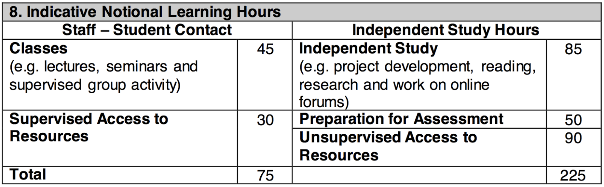

# Session 1

### Today, Tuesday 9th January

1. Welcome
2. Launching your project
3. Workshop: Introducing Trans-media
4. Ideation 

### Your [homework](#homework) and [blog](#blog)!

# Welcome

# Homework

### Peer-learning research

Who | What
--- | -----------
Peyman Callum  | Opening and Closing & Fire Starting
Richardo Jacob | Artifacts & Node Generation
Muhammad Emma  | Meaningful Space & Sketching and Model Making
Domenic Kevin  | Randomness, reversal, and reframing & Improvisation
Mayur Kaleshe  | Selection & Try something new

### Project

### Blog

Keeping a **journal** to record your creative process is extremely important. Don't let your ideas and thoughts fade away! Think of your blog as your *digital sketchbook* (more on that [here](https://github.com/RavensbourneWebMedia/Blogging#why-blogging)). We ask you to blog regularly and we'll check that you do it every week.

**What are some of the fundamental elements (for example structure and characteristics) that are required to develop a interactive narrative and why?**
