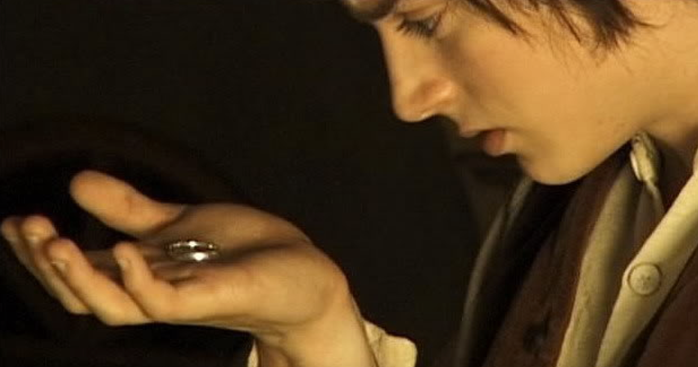
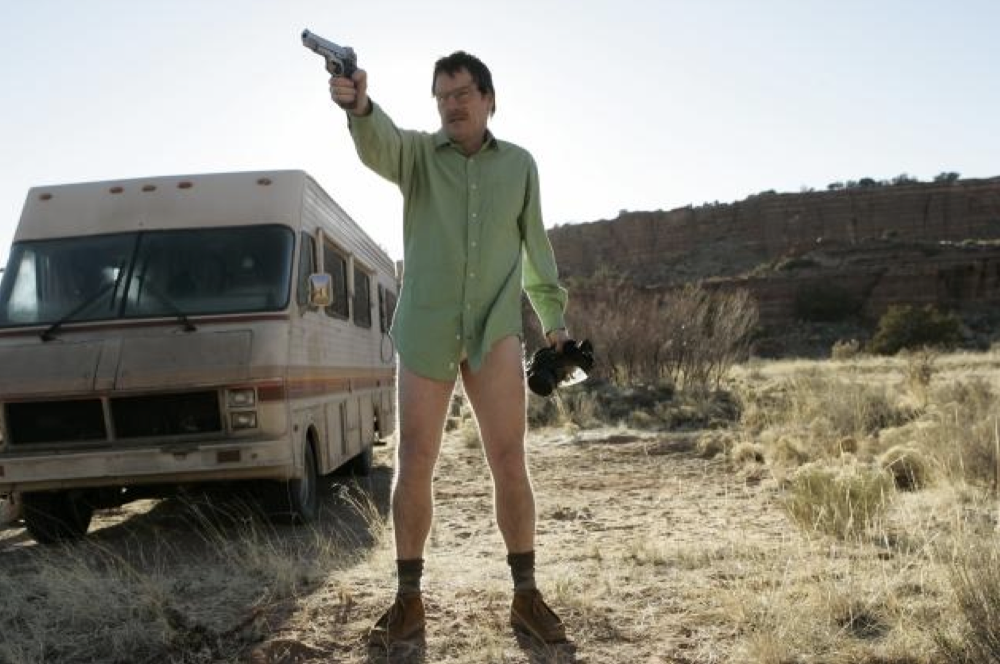
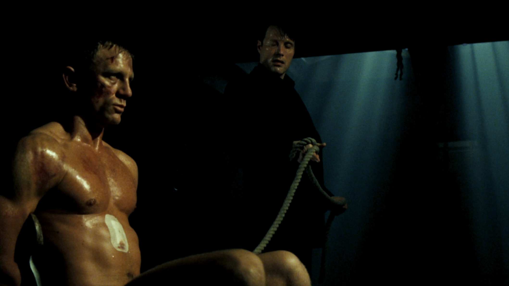
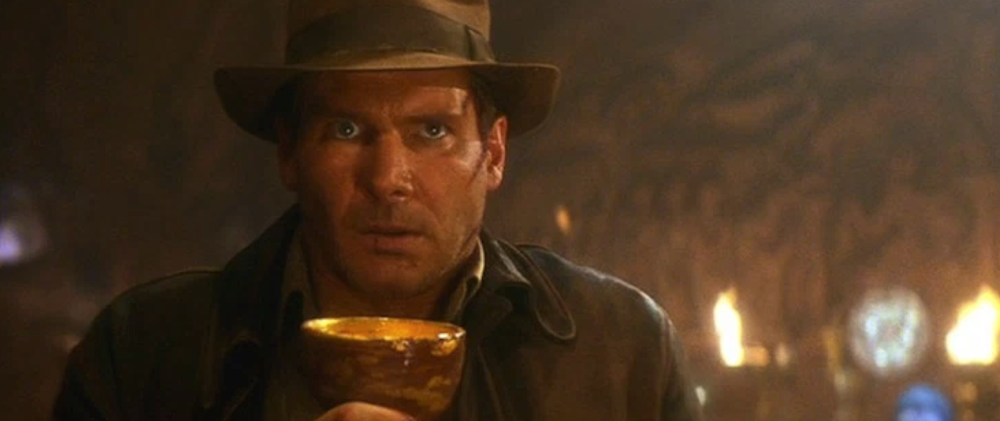
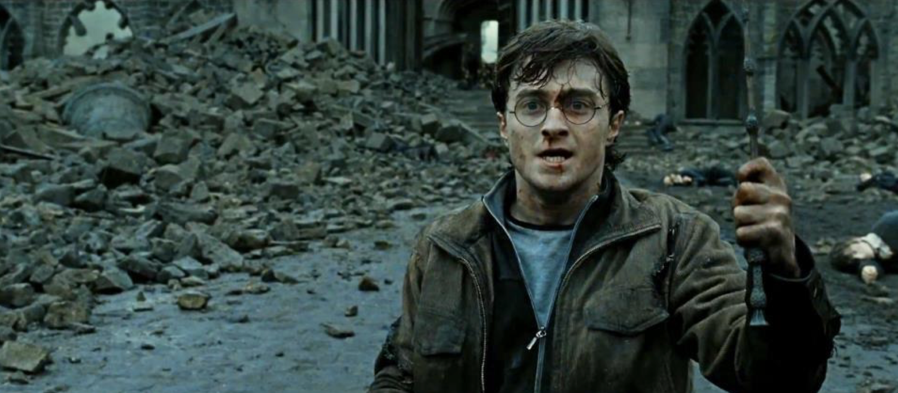
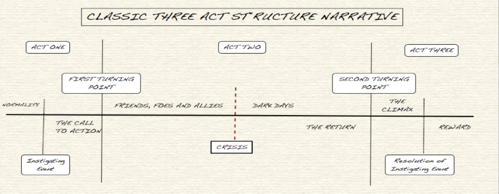

# Session 2

### Today, 16th January

1. Peer-learning mini-lesson
2. Lecture: The principles of storytelling

#Peer-learning mini-lesson

**GOING WAY BACK NOW...**
* The roots of story telling
* The roots of narrative
* The roots of interaction

Who | What
--- | -----------
Peyman Callum  | Gilgamesh
Richardo Jacob | Aristotle
Muhammad Emma Kaleshe  | The Dogon Dancers versus The Mystery Plays
Domenic Kevin Mayur  | Beowulf

Analyse the allocated story above with the help from the questions bellow to present next week.

**Artistotle**
* Who was he?
* When and where?
* What did he have to say about story? n  What is left of his ideas?

**The Dogon Dancers vs The Mystery Plays**
* What where and when?
* How did they tell story?
* Why are we talking about them?

**Gilgamesh**
* What was it?
* What was the story?
* Break it into three act structure

**Beowulf**
* What was it?
* What was the story?
* Break it into three act structure

# Lecture: The principles of storytelling

### WHEN DO WE TELL STORIES?

**To convey information**
* To give instructions
* To create an impression
* In drama
* In documentary
* In verse
* In advertising
* In game design
* To organise our lives

* A story is a sequence of events.
* These events are known as the plot

### Three-Act Structure
**The foundations of modern storytelling**

**ACT 1: COMPLICATION**
 
Balance, harmony, happiness... something comes to throw the character and the balance in their life.

**ACT 2: DEVELOPMENT**
 
Problem worse than they thought, and character now faces a series of developments that raise the stakes..

**ACT 3: RESOLUTION**
 
Character learns that he or she must pit everything in his or her power to resolve this issue and to achieve their goal.

### ACT ONE: COMPLICATION
* Protagonist is shown in his/her ordinary world
* There is an event: A Call to Adventure n He/she must decide whether to answer “the call”
* They encounter the first turning point

### ACT TWO DEVELOPMENT
* The body of the story.
* What it is “about”
* Encounter challenges n  Meet allies
* Take advice from Mentors
* Undergo an ordeal (the dark days)
* Survive and return renewed

### ACT THREE RESOLUTION
* The protagonist returns, only stronger
* Begins with the Second Turning Point
* Resolution
n Resurrection (re-born/change)
* Return with the Elixir/Glory

### Your [homework](#homework) and [blog](#blog)!
