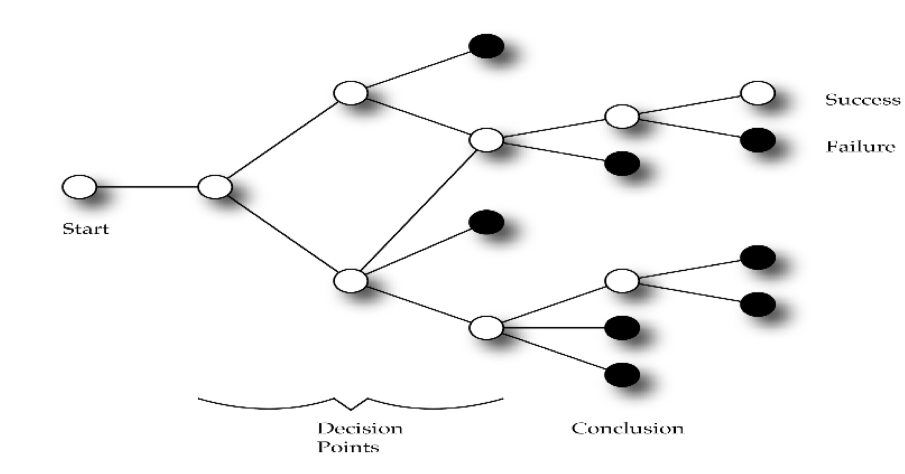

# Session 2

### Today, 16th January

1. Peer-learning mini-lesson
2. Lecture: The principles of storytelling
3. Workshop: Develop your  story!

### Your [homework](#homework) and [blog](#blog)!

### Peer-learning mini-lesson

**GOING WAY BACK NOW...**
* The roots of story telling
* The roots of narrative
* The roots of interaction

Who | What
--- | -----------
Peyman Callum  | Gilgamesh
Richardo Jacob | Aristotle
Muhammad Emma Kaleshe  | The Dogon Dancers versus The Mystery Plays
Domenic Kevin Mayur  | Beowulf

Analyse the allocated story above with the help from the questions bellow to present next week.

**Artistotle**
* Who was he?
* When and where?
* What did he have to say about story? n  What is left of his ideas?

**The Dogon Dancers vs The Mystery Plays**
* What where and when?
* How did they tell story?
* Why are we talking about them?

**Gilgamesh**
* What was it?
* What was the story?
* Break it into three act structure

**Beowulf**
* What was it?
* What was the story?
* Break it into three act structure

# Lecture: The principles of storytelling

### WHEN DO WE TELL STORIES?

**To convey information**
* To give instructions
* To create an impression
* In drama
* In documentary
* In verse
* In advertising
* In game design
* To organise our lives

* A story is a sequence of events.
* These events are known as the plot

## Three-Act Structure
**The foundations of modern storytelling**

**ACT 1: COMPLICATION**
 
Balance, harmony, happiness... something comes to throw the character and the balance in their life.

**ACT 2: DEVELOPMENT**
 
Problem worse than they thought, and character now faces a series of developments that raise the stakes..

**ACT 3: RESOLUTION**
 
Character learns that he or she must pit everything in his or her power to resolve this issue and to achieve their goal.

### ACT ONE: COMPLICATION
* Protagonist is shown in his/her ordinary world
* There is an event: A Call to Adventure n He/she must decide whether to answer “the call”
* They encounter the first turning point

### ACT TWO DEVELOPMENT
* The body of the story.
* What it is “about”
* Encounter challenges
* Meet allies
* Take advice from Mentors
* Undergo an ordeal (the dark days)
* Survive and return renewed

### ACT THREE RESOLUTION
* The protagonist returns, only stronger
* Begins with the Second Turning Point
* Resolution
* Resurrection (re-born/change)
* Return with the Elixir/Glory

### The hero's journey

https://www.youtube.com/watch?v=Hhk4N9A0oCA

https://www.huffingtonpost.com/entry/is-joseph-campbells-the-h_b_8861998.html

### Plot and Character
* Plot describes what characters do.
* The essence of character is revealed by the actions they take.
* Plot brings pressure on the hero. n  Forcing him to change/reveal his inner self.

### MORE ELEMENTS
**PREMISE**
The purpose of a story.
The truth learnt by the protagonist.
The more simple and direct – the stronger it is.
It is the test against which every element is weighed.

**CONFLICT**
* There has to be conflict.
* There have to be obstacles.

For example...
* Man vs Man.
* Man vs Nature.
* Man vs Woman.
* Man vs Himself.
* Man vs Machine.
* Man vs Ghost...

Hero | Villain
--- | -----------
Focus of story | Most important thing is what he / she wants
Attempting to restore balance to his / her world | Obstructs hero’s progress
The hero grows and in so doing becomes a better person | Starts off stronger and more resourceful
Makes gradual changes through the story | Conflict can be more powerful when the characters of Hero and Villain are matched
N/A | Believes they are justified in their actions

### The Climax
* The most important decision the hero takes
* Ultimate point of tension
* Most difficult decision n High point of action

## Introduction to non-linear story-storytelling

* ‘If’ the character does
something
* ‘Then’ something else happens
* Allows only two possible outcomes

### Branching Narrative
* Much more complex
* Much more multi-layered
* Involves a great deal of planning
* Can begin to create the impression of free-will
* Player has to be subtly guided along the correct paths

## Parallel Paths
* Two ways of playing the game
* The good guy or the bad guy
* Two different perspectives on the same events
* Limits options but can make game manageable
* As used in Bioshock – ie kill or don’t kill little sisters

## Explorer Interactive Narrative
* Used in ARGs, MMORPGs and “sandbox” games
* Many discrete storylines
* Multiple connections between events
* User – Explorer may not even experience them all
* Allows personalisation of the experience
* Create impression of interactivity when it is very structured.

# Workshop: Develop your story!

* What event can happen to our characters?
* What event could we create that they could respond to?
* How shall we make this event happen?
* How would your character respond?

### Diversify your character!

* Create Tumblr / LinkedIn etc for your character
* Status updates
* Written pieces
* Photos
* Videos
* Build websites for fake companies / portfolios of work / blogs
* Tell the story through the content posted by the character

### Creating the backstory...
* Go to your character on Twitter etc
* Start chatting
* Make communications
* Make links
* Steal pictures...
* Steal videos...
* Steal text...
* Borrow the real to make the imaginary...
* What happened to you last week?
* Was it a good week or bad week?
* Are you angry with anyone?
* Has someone let you down?
* Did you make any new friends?
* Meet someone wonderful?
* Have you got a picture of them?
* Have you got a picture of where you went?
* What do you think of events in RL?

# Homework

### Peer-learning mini-lessons

Pick your favourite film, analyse it with the three act theory and the hero's journey theory. Next week you will present your analysis in an interactive way.

### Blog

Keeping a **journal** to record your creative process is extremely important. Don't let your ideas and thoughts fade away! Think of your blog as your *digital sketchbook* (more on that [here](https://github.com/RavensbourneWebMedia/Blogging#why-blogging)). We ask you to blog regularly and we'll check that you do it every week.

**Research, evidence and explain case studies of how storytelling has been instrumental in the creation of communities and cultures in modern times**
