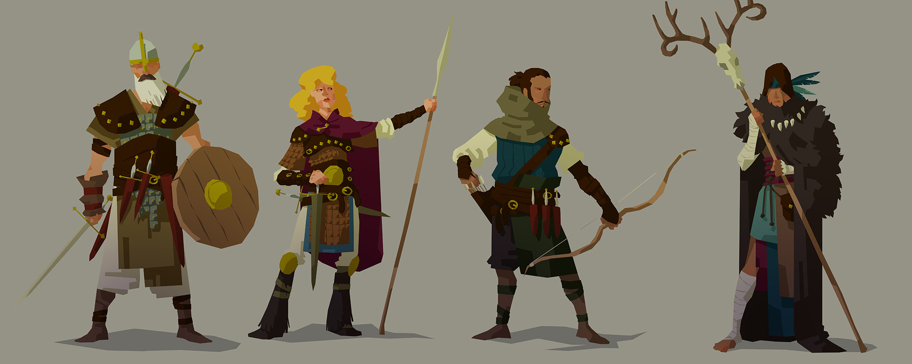
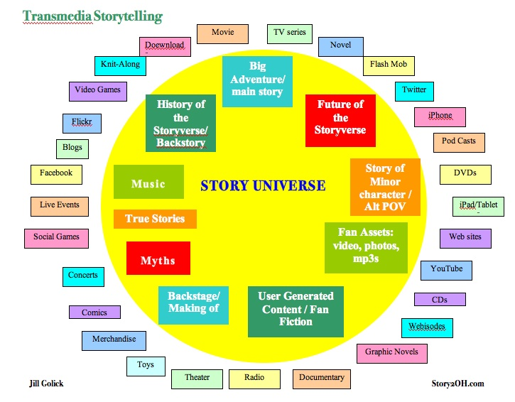

# Session 3

#### Share a story from yesterday, tell your peer

Share a story from yesterday, your peer will listen and then tell your story back to the group.

## Flesh out your character on paper

> Refer to earlier sessions

## Flesh out your story line on paper

> Lets create some ***'touch points'***

## Twinery lecture

> Follow my lecture on twine

This is a [link to the twine lecture on moodle](https://moodle.rave.ac.uk/pluginfile.php/177228/mod_resource/content/1/Interactive%20Narrative%20Twine%201.pdf)

## Twinery workshop

> How far can we take a twine and incorporate it in your story?

## What did you learn today?

# Homework

### Peer-learning mini-lessons

Use the book called [Believe Me](https://github.com/RavensbourneWebMedia/Interactive-Narratives/blob/2018/sessions/03/assets/BelieveMeStoryManifesto_ReadandShare.pdf) to find your allocated concepts to explain.

In small teams, you will research one storytelling concept or technique and prepare a **mini-lesson** (~15 minutes) to teach everyone else about it.

Your mini-lesson will be **interactive**: try and make a mini-workshop, rather than just have us listen.

Who | What
--- | -----------
Domenic Callum  | Meaning (p. 4 - 6)
Kaleshe Jacob | Perception (p. 6 - 8)
 Emma Richardo  | Relationship (p. 8 - 10)
Peyman Kevin  | Memory (p. 10 - 12)
Muhammad Mayur | Choice (p. 12 - 14)

### Blog

Keeping a **journal** to record your creative process is extremely important. Don't let your ideas and thoughts fade away! Think of your blog as your *digital sketchbook* (more on that [here](https://github.com/RavensbourneWebMedia/Blogging#why-blogging)). We ask you to blog regularly and we'll check that you do it every week.

**What are your strength and weaknesses in relation to completing this project? And how are you going to address them?**
