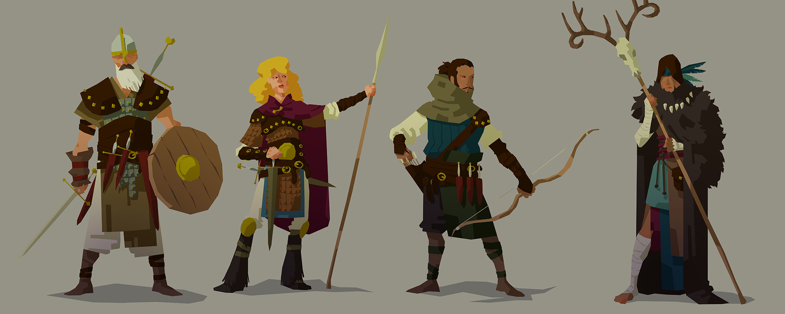
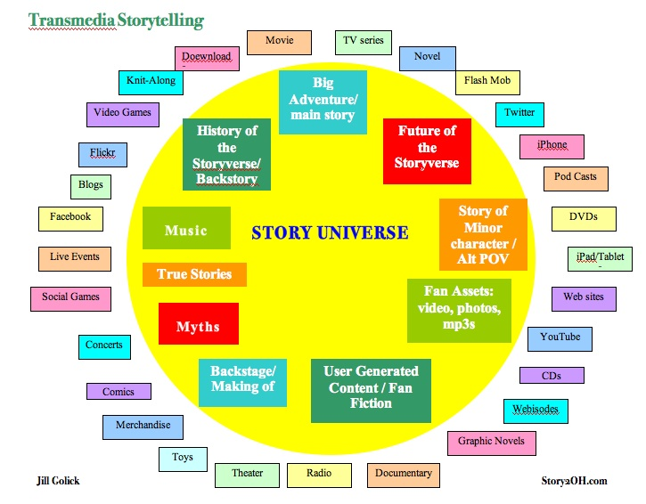

# Session 4

# Peer-mini-lessons

Who | What
--- | -----------
Domenic Callum  | Meaning (p. 4 - 6)
Kaleshe Jacob | Perception (p. 6 - 8)
 Emma Richardo  | Relationship (p. 8 - 10)
Peyman Kevin  | Memory (p. 10 - 12)
Muhammad Mayur | Choice (p. 12 - 14)

### Lets recap what we have learnt over the last couple of weeks.

> What have we learnt over the last couple of weeks?

<!-- Transmedia, how storytelling affects the mind - what is it? -->

<!-- Characters, plot, aristotle tragedy - what is it? -->

<!-- How stories are structurd - act1,act2,act3, the herous journey, the climax, hero vs villain,  -->

<!-- The different types of narrative -->

<!-- Twine -->

## Flesh out your character on paper

> Refer to earlier sessions

## Flesh out your story line on paper

> Lets create some ***'touch points'***

## What did you learn today?

# Homework

### Peer-learning mini-lessons

Use the book called [Believe Me](https://github.com/RavensbourneWebMedia/Interactive-Narratives/blob/2018/sessions/03/assets/BelieveMeStoryManifesto_ReadandShare.pdf) to find your allocated concepts to explain.

In small teams, you will research one storytelling concept or technique and prepare a **mini-lesson** (~15 minutes) to teach everyone else about it.

Your mini-lesson will be **interactive**: try and make a mini-workshop, rather than just have us listen.

Who | What
--- | -----------
Domenic Kaleshe  | Disbelief (p. 18 - 20)
Callum Jacob | Culture (p. 20 - 22)
Emma Peyman  | Leadership (p. 22 - 24)
Richardo Muhammad  | Convergence (p. 24 - 26)
Kevin Mayur | Epic (p. 26 - )

### Blog

Keeping a **journal** to record your creative process is extremely important. Don't let your ideas and thoughts fade away! Think of your blog as your *digital sketchbook* (more on that [here](https://github.com/RavensbourneWebMedia/Blogging#why-blogging)). We ask you to blog regularly and we'll check that you do it every week.

**Pair up with another person (not your team mate) and give each other feedback on your peer learning mini-lessons**
