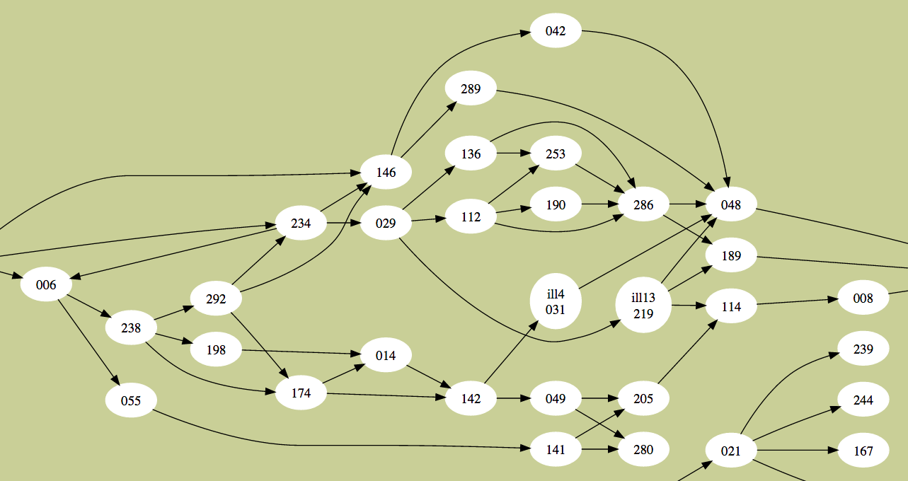
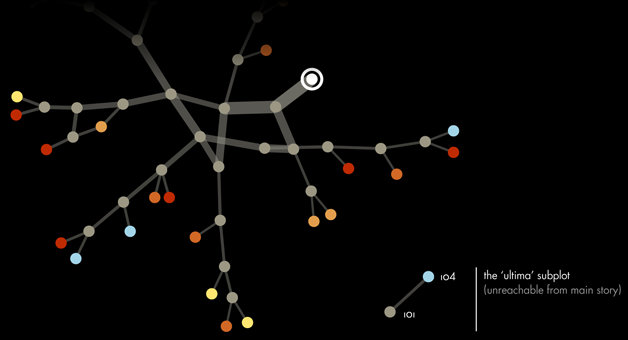
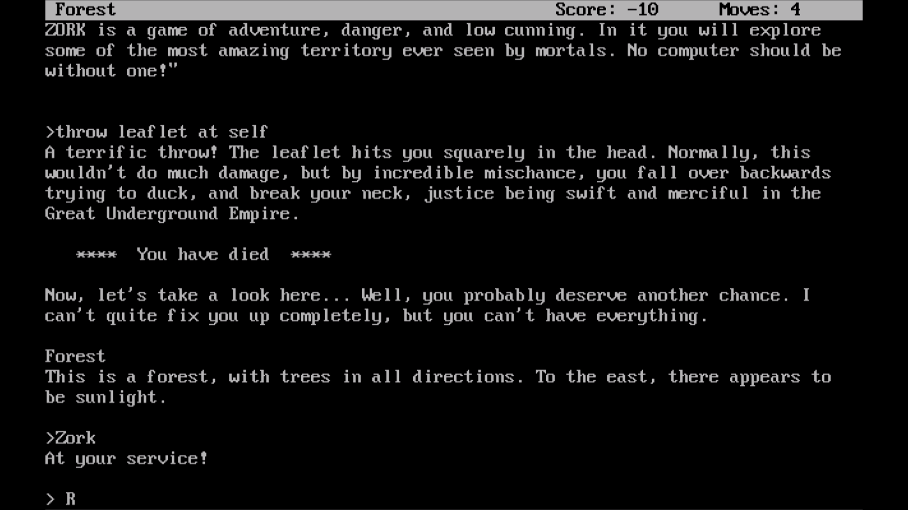
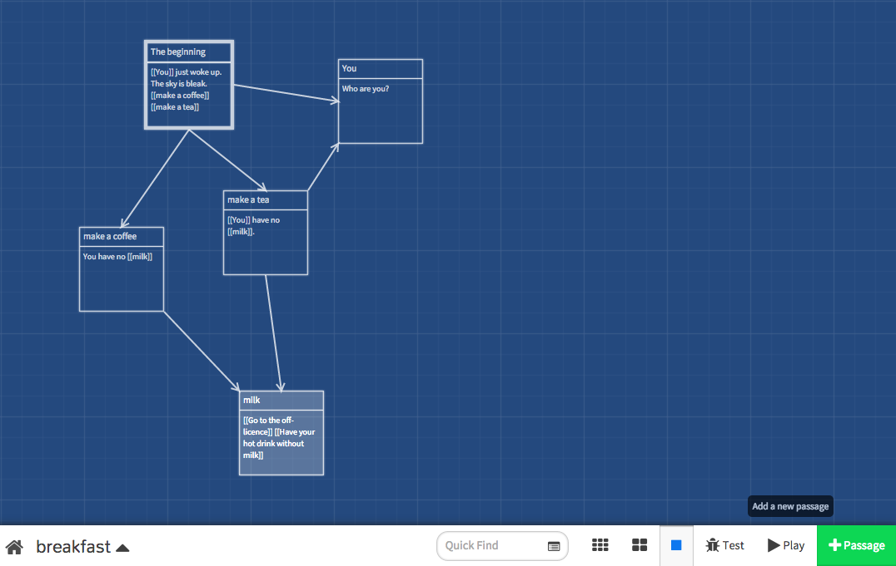
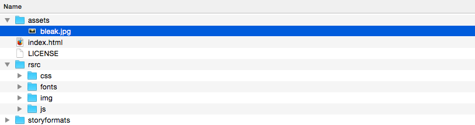
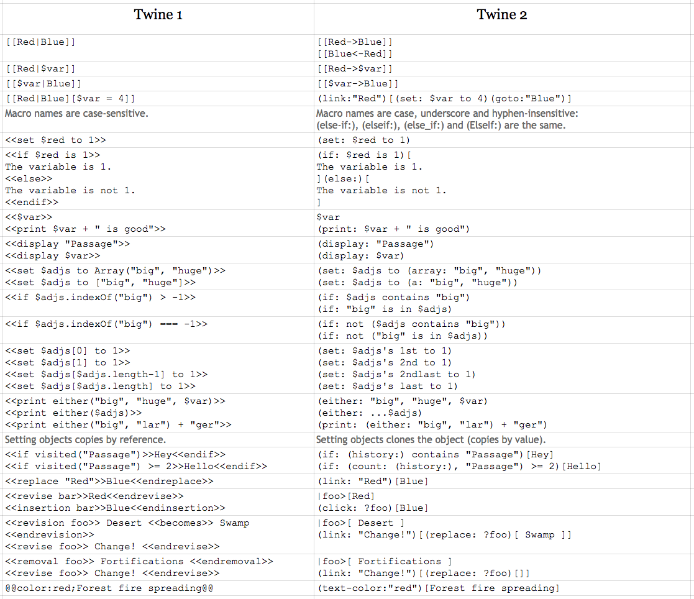

# Session 2 

### Today, 23rd April 

1. [Board games](#board-games)
2. [Home-play debate](#home-play-debate)
3. [Branching narratives](#branching-narratives) with [Twine](#twine)

Your [homework](#assignments)!

# Board games

We'll play *critically* two popular board games

1. Monopoly 
2. Settlers of Catan


### [Settlers](http://www.catan.com)

Designed by [Klaus Teuber](http://en.wikipedia.org/wiki/Klaus_Teuber), first published in 1995.

This game started the board game *resurgence*.

### [Monopoly](http://en.wikipedia.org/wiki/Monopoly_%28game%29)

Originally designed as an educational game in 1903, called the *Landlord's game* to teach people about the negative impact of monopolies.

It then turned into the opposite.

There's even an *electronic banking* version for that post-credit-crunch dopamine rush..

### Your tasks

<!--Questions

* What makes this game(s) so good?-->

**Player experience**

* Write down **what you're doing** and how you're **feeling**
* What are you expected to feel? 	

**Core mechanic**

How does the game function? 

**Objective**

* How do you win?
* Can you win?

**Rules**

* Which are the most influential?
* How do they limit behaviour?
* How many rules are enough?

**Resources**

* What are they?
* How do they aid achieving the objective?

**Conflict**

* How is it created?
* How does it aid experience goals?

**Outcome**

What happens when you win?

**Story**

* How does the backstory contribute to player experience?
* Are there any **characters**?
* How do they contribute to the premise?

**Simulation**

* What activities in life does the game simulate?
* How closely does the game relate to real life?


<!--* List 5 areas of your life that could be games. Then briefly describe a possible underlying game structure for each.
* Think of things you enjoyed as a child.
* List 10 games you played as a child. What was compelling about those games?
-->
<!--Player experience goals

Core mechanic

Videos - Big Bang Theory, Tutorial-->


# Home-play debate

Present the story-game you [played and analysed](sessions/session-01.md#assignment).

1. Pitch your story-game in one sentence. You want to convince us to play it! 
2. On a scale from `0` (no game - only story) to `10` (no story - only game), where would you place your story-game and why?

### Analysis framework

Consider your story-game as a system of **narrative representation**. 

* What is the **situation**? What are the *events* that happen in your story-game?
* Who are the **characters** and what are their *goals*?
* How is the story delivered?
	* Which narrative elements are **embedded** (pre-generated parts of the story, eg: scripted scenes)?
	* Which narrative elements are **emergent** (created on-the-fly as you play)?
	* What is the *balance* between embedded and emergent narratives?
* What **conflicts** are there, between players or between player and the game system? 
* How is the game creating **uncertainty** to fuel tension and keep you hooked?
* What role does the **setting** play?
* What about the **visual design**?

<!--#### Cybernetics

Find at least one **feedback loop** that contributes to the overall system of the game. Identify the sensor, comparator and actuator in the loop.

* Is it a positive or negative loop?
* How does the feedback loop affect the overall gameplay experience?
* What would happen if it were taken out of the game?
* How could the rules be changed to exaggerate the effects of the feedback loop?
* What is a different feedback loop that may improve the game?

#### Social interaction

* Is there *forbidden play* (can you cheat, and how does the game react to it)?
* What's your role as a player?-->


# Branching narratives

> If I throw a ball at you, I don’t expect you to drop it and wait until it starts telling stories

[Markku Eskelinen](http://www.gamestudies.org/0101/eskelinen)

<!--Let's **brainstorm** concepts related to games, stories, what they have in common and what they don't have in common.-->




Before videogames...

* **Dada** poems
	
	>	**To make a Dadaist poem**
	
	> * Take a newspaper.
	> * Take a pair of scissors.
	> * Choose an article as long as you are planning to make your poem.
	> * Cut out the article.
	> * Then cut out each of the words that make up this article and put them in a bag.
	> * Shake it gently.
	> * Then take out the scraps one after the other in the order in which they left the bag.
	> * Copy conscientiously.
	> * The poem will be like you.
	> * And here you are a writer, infinitely original and endowed with a sensibility that is charming though beyond the understanding of the vulgar.
	
	[Tristan Tzara, 1920](http://en.wikipedia.org/wiki/Tristan_Tzara)

* Jorge Luis Borges **[The Garden of Forking Paths](http://en.wikipedia.org/wiki/The_Garden_of_Forking_Paths)** (1941)
	
	In the short story a character named Ts'ui Pên tells everybody that he wanted to write a book and build a labyrinth. Nobody ever found the labyrinth, only a very confusing and contradictory book. We then discover that the book *is* the labyrinth. In the fictional book, every chapter is followed by "every" possible continuation.

* Raymond Queneau **[Hundred Thousand Billion Poems](http://www.bevrowe.info/Queneau/QueneauRandom_v4.html)** (1961)

	Derived from a set of ten basic sonnets, they are printed on card with **each line on a separated strip**, like a heads-bodies-and-legs book. All ten sonnets have the same rhyme scheme and employ the same rhyme sounds. As a result, any line from a sonnet can be combined with any from the other nine, giving 1014 (= 100,000,000,000,000) different poems. Working twenty-four hours a day, it would you take some 140,000,000 years to read them all.
	
	

* [Gamebooks](http://samizdat.cc/cyoa), aka *Choose Your Own Adventure* in the 1970s and 80s

	[](http://samizdat.cc/cyoa)
	
	You can find many of them on [Project AON](http://www.projectaon.org/en/Main/Books)

* **HyperText** is a word [Ted Nelson](http://en.wikipedia.org/wiki/Ted_Nelson) coined in the 60s. 

	> A system of **non-sequential writing** that would allow the reader to aggregate meaning in snippets, in the order of his or her choosing, rather than according to a pre-established structure fixed by the author.
	
	We're now familiar with hypertext because of the World Wide Web (invented in 1989) but in the 80s it was quite a weird thing, with a literary potential.

<!--Examples: [Afternoon](http://www.wwnorton.com/college/english/pmaf/hypertext/aft/index.html) and [253](http://www.ryman-novel.com/)-->

* **Text Adventures** like [ZORK](http://en.wikipedia.org/wiki/Zork) were massively popular in the 80s.

	[](https://www.youtube.com/watch?v=ikYv6OsgGSk)

<!--[Choose your own adventure](http://www.theguardian.com/commentisfree/2014/oct/20/gamergate-internet-toughest-game-woman-enemies) (sort of) by Charlie Brooker-->

More and more on [Electronic Literature](http://directory.eliterature.org)

# Twine

<!---->

> [Twine](http://twinery.org) is an open-source tool for telling interactive, nonlinear stories.

> You don't need to write any code to create a simple story with Twine, but you can extend your stories with variables, conditional logic, images, CSS, and JavaScript when you're ready.

Great examples of interactive narratives made with Twine:

* [Ultra business tycoon III](http://aliendovecote.com/uploads/twine/tycoon/crime.html)
* More [games by Porpentine](http://aliendovecote.com/hypertext.html)


<!-- Review of UBT3  on http://www.gamasutra.com/view/news/198341/The_poignant_vocabulary_of_Porpentines_Ultra_Business_Tycoon_III.php -->

Learn how to use Twine on the [Twine Wiki](http://twinery.org/wiki/twine2:guide). 

### Getting started

1. Go to [Twine](http://twinery.org) and **download version 2**
2. Unzip the Twine package
3. Open the `index.html` in your favourite browser
4. Click on `+ Story` to create a new story.



Your story *building blocks* are called **passages** and Twine lets you move them around in this *map*.

### Editing passages

Double-click a passage to edit it.

Twine uses a  *markup language* similar to MarkDown, called [**TwineMarkup**](http://twine2.neocities.org). 

Click on the rocket :rocket: icon to set a passage as the **starting point** of your twine.

### Linking passages

To set your story in motion you create clickable **hyperlinks between passages**. 

```
You just woke up. The sky is bleak.

* [[Make a coffee->coffee]] is a link that goes to a passage named "coffee"
* [[tea<-Make a tea]]  is a link that goes to a passage named "tea"
```

Inside matching non-nesting pairs of `[[` and `]]`, place the link text and the passage expression, separated by either `->` or `<-` with the arrow pointing to the passage expression.

### Jumping to passages

Sometimes you want to take people straight to a passage, without them having to click. Or as a result of a certain event...

```
(display: "tea")
```

### Images

You can use good old HTML to include images

```html

<!-- you can also use HTML comments to make notes and hide secret messages -->
<!--  -->
```

Create a sub-folder in the Twine folder and call it `images` or `assets` or whatever you like, and dump all your story media files in there.



Later, when you publish your story, you will need to copy all your `assets` in the same folder where your story is published, so that you won't have broken links.

More on that [here](http://twinery.org/forum/discussion/comment/6056/#Comment_6056).


### Variables

So far we've just linked a bunch of texts (*hypertext*).

How about keeping a *score*? Or asking players a *question* and then using their answer later on in the game?

<!--The code that a passage can contain includes ways of setting a variable to a particular value and conditionally displaying text based on variables' current values.--> 

```
You had no milk for $milkDays days. 
You have $quid quid on you. 
```

`$milkDays` and `$quid` are variables.

All variables must start with `$`, like in PHP :elephant:

#### Setting variables

You can manipulate your *game state* with **macros**, which are snippets of code to set or compare variables.

```
(set: $milkDays to 2)
```

You may want to set certain variables at the very beginning of your twine, in the first *starting point* passage.

<!--Geeks call this to *initialise variables*.-->

To increment a numeric variable

```
(set: $milkDays to $milkDays + 1) 
```

#### Comparing variables

```
(if: $quid is 0) [You need to [[get money]] first]
```

### Asking questions

Use the `prompt` function, like in JavaScript 
```
(set: $userName to prompt("What's your name?"))
Hello $userName :)
```

### Randomness

To get a random number in a range of numbers

```
(set: $milkDays to (random: 1,10)) 
```

To display a random word/string from a list
```
Why don't you (print: (either: "tell me", "let him know", "write to her")) how you feel?
```

### Branching logic

To simulate a 50-50 coin flip

```
(if: (either: 0, 1) is 0)[ The off-licence is shut! ]
(else:)[ They have only goat milk ]
```

A slightly more sophisticated example from [this tutorial](http://lambdamaphone.blogspot.co.uk/2015/02/using-twine-for-games-research-part-ii.html)

```
(if: (either: 0, 1) is 0)[  
  The monster bites you! 
  (set: $health to $health - (either: 1,2,3))  
  (if: $health < 1)[ You are [[dead]]! ]  
  (else:)[ Your health is $health. 
    [[fight]] 
    [[flee|main]] ]  
]
(else:)[ You hit the monster!  
  (set:$monsterHealth = $monsterHealth - 1)  
  (if: $monsterHealth < 1)[ The [[monster is dead]]! ]  
  (else:)[    
    Its health is $monsterHealth.
    [[fight]] 
    [[flee|main]] ]  
]
```

### Custom stuff

You can add [your own Javascript and CSS](http://twinery.org/wiki/twine2:adding_custom_javascript_and_css) to twines.

#### All together now...




<!--More sophisticated tools worth mentioning:

* [Undum](http://undum.com/) (allows for more variables/states)

* [Inform 7](http://inform7.com/) it's a whole different way to conceive programming (using natural language)-->

<!--Tutorial on how Twine works (see [this video tutorial](https://vimeo.com/5010370) and the following from that guy), then..-->

# Your turn

Write a branching story with one or more of the following features:

* Non-human main character
* Events out of chronological order
* Multiple characters

Write the first paragraph and (at least) a couple of examples of choices.

Illustrations / images / animations are a bonus.


# Assignments

### 1. Build your story using [Twine](http://twinery.org) <sup>INDIVIDUAL</sup>

Try to keep each passage to one or two paragraphs.

Don't provide many choices, provide *interesting choices*.

Think about how your story can be delivered:

* Spatial? Metaphysical? Puzzle?
* Self-aware / self referential?
* First, second, third person?
* Multiple endings? 
* Multiple beginnings?
* Do you control an avatar?
* Does it have graphics? 
* What's the relation between graphics and text?

1. Publish your *twine* to the Web (your personal Rave Web space, [Philomela](http://www.philome.la), [NeoCities](https://neocities.org), anywhere you like..)
2. Push the source code to [your folder inside the students folder on GitHub](../students), together with a link to the published twine.

### 2. Ideas hoarding <sup>TEAMS</sup>

Each member of your team jots down a couple of game ideas that could enhance the story you developed last term. 

Write a couple of paragraphs for each game idea. A sketch of its interface is a bonus.

You should end up with 6 ideas per group.

<!-- 

http://www.sibylmoon.com/twine-as-a-prototyping-tool/

-->
