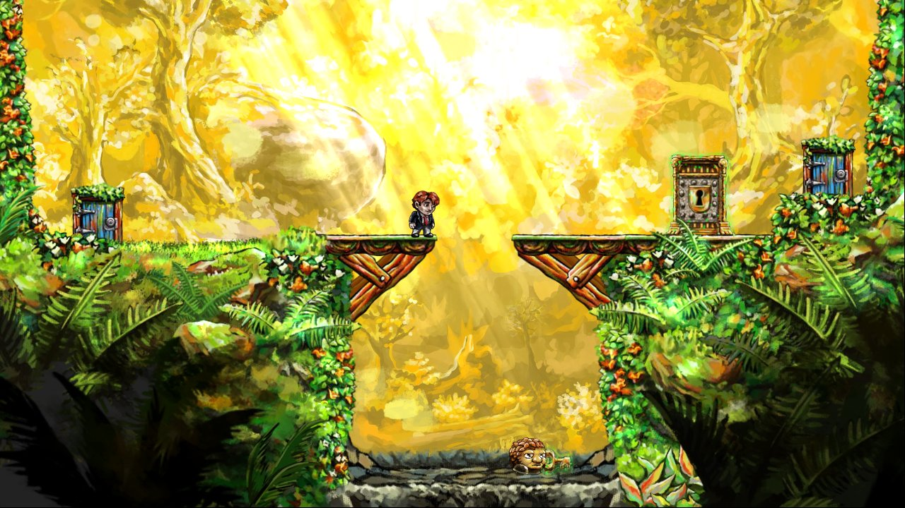
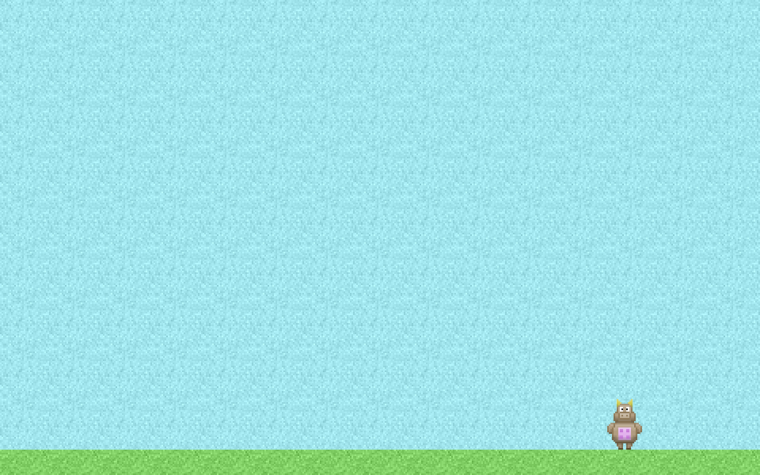

# Session 3 

### Today, 30th April

* Special guest: [Joe Dytrych](https://twitter.com/somehats) form [DrumRoll](http://drumrollhq.com/)
* [Games with a purpose](#games-with-a-purpose)
* [Phaser](#phaser)

Your [homework](#homework)!

# Games with a purpose

> 10.000 hours: time needed to master something

> Also the time people spend playing games by the time they're 21

Watch this TED talk [Jane McGonigal - Gaming can make a better world](http://www.ted.com/talks/jane_mcgonigal_gaming_can_make_a_better_world?language=en#t-464468)

> Educational games suck

**Games that teach**

- [Erase All Kittens](https://staging.eraseallkittens.com)
- story-driven
- it's first a game, then an educational tool
- you can edit levels by changing their HTML
- introduce concepts gradually

> People don't read tooltips

[Braid](http://braid-game.com) has an interesting way of embedding learning how to use the game interface, at the very beginning of the game. There are for instance illustrations of arrow keys embedded in the game landscape.

# Twine review

* How many different endings are there?
* Is there a preferred path for players/readers to follow, and other paths that will eventually lead to the main path?
* Show us the story map
* Is the player impersonating a character?

[Using variables](session-02.md#variables) in Twine to: 

* expand the possibilities
* avoid repetition 
* make the story more personal

# Expanding narratives

From [Nick Case's blog](http://blog.ncase.me/if-games-were-like-game-stories/)

<!--### Exercise

We give students the first sentence of a story, their brief is to develop it in a branching narrative. Working in small groups for an hour or so, then present and discuss results with the rest of the class.-->

Examples and inspirations: 

- [Coming Out Simulator 2014](http://ncase.itch.io/coming-out-simulator-2014) and its [source code](https://github.com/ncase/coming-out-simulator-2014)
- [Gamer mom](http://adventure.gamism.org/gamer_mom/)

# Phaser

[Phaser](http://phaser.io/) is a free, fast and flexible framework to makes HTML5 games.

Links:

- [ServerThingy](https://github.com/DecodedCo/server-thingy/releases) is a little app to get a simple Web server running from any folder on your computer. If you have [WAMP](http://www.wampserver.com/en/#wampserver-64-bits-php-5-3), [MAMP](https://www.mamp.info/en) or [XAMPP](https://www.apachefriends.org) you can use one of those instead
- [Mighty Editor](http://mightyfingers.com/)
- [Phaser Examples](http://phaser.io/examples)
- [Phaser Sandbox](http://phaser.io/sandbox)

Today we'll build *Moorio*, a [platform game starter kit](../resources/hellophaser)

<!--[Dialogger](http://j.dytry.ch/stuff/dialogger) (or similar tool that integrates with [Phaser](https://phaser.io/learn)) tutorial and workshop: how to translate a story into JSON

There may be some time left for q&a-->

<!--Check out [RenPy](http://www.renpy.org), a *visual novel engine*-->

> Vertical movement gives people motion sickness

# Homework

Using [Twine](http://twinery.org), create a **multiple choice dialogue** with a virtual character. 

Pick one of these creative constraints:

1. The non-player character (aka *NPC*) is the portrait or caricature of a person you know

* The NPC is based on the personality types from the [Myers-Briggs](http://www.16personalities.com/free-personality-test) test (it's [pseudo-science](http://en.wikipedia.org/wiki/Myers%E2%80%93Briggs_Type_Indicator))

* The NPC is a credible depiction of someone affected by mental or behavioural disorder

* Any of the above, but applied to the player's character

These questions may help you get started:

* What's the type of conversation: banter, interview, date, interrogation, argument? etc.
* What's the relationship between the two characters?
* What's the *power relationship* between the two characters?
* How do the player and NPC feel initially: friendly, bored, anxious, relaxed, aggressive? etc.

<!--brew install cowsay -->
