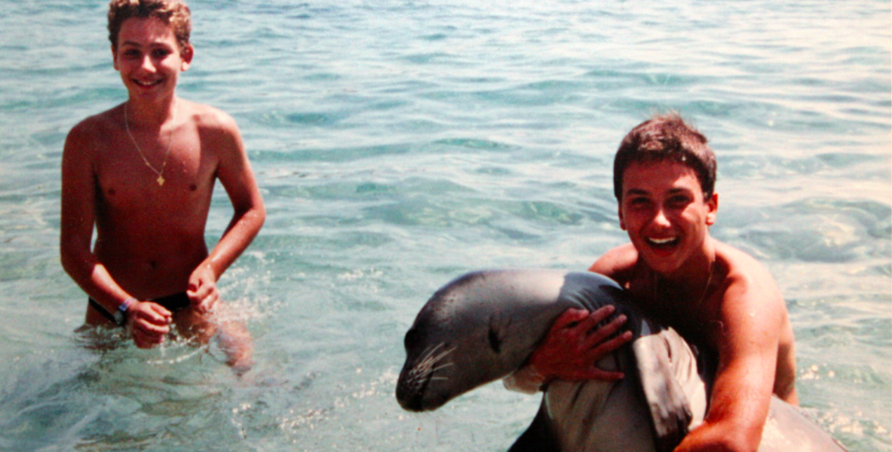
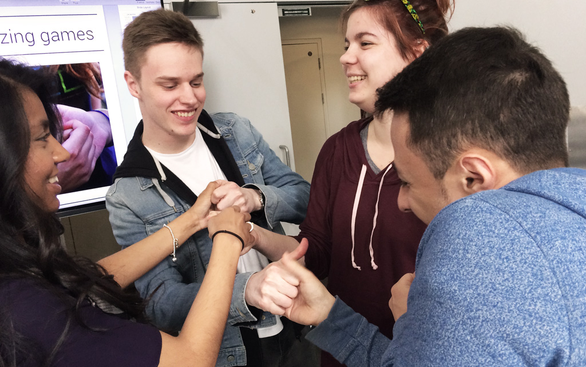
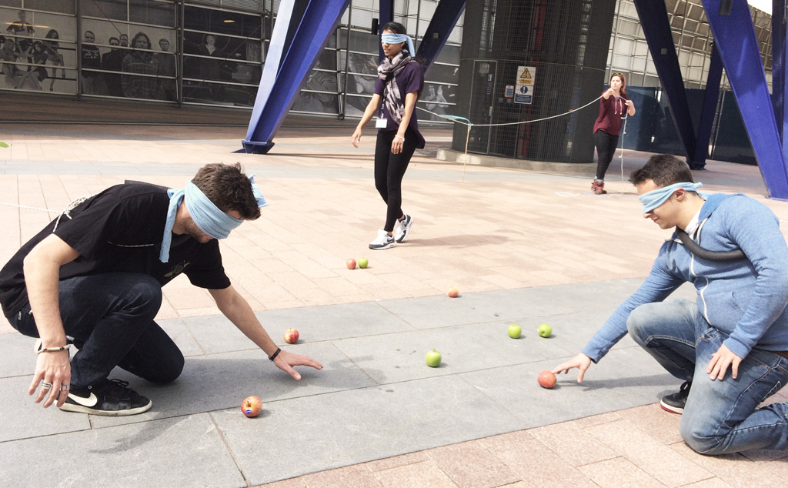
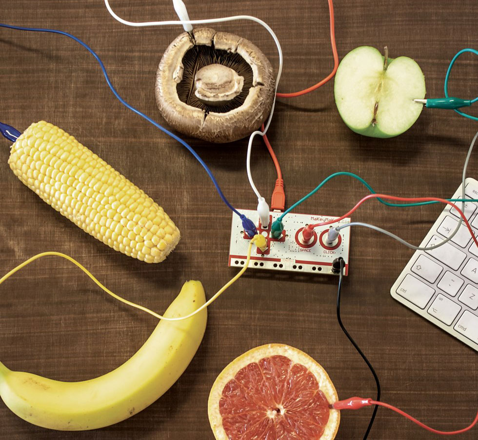

# Session 4 

### Today, 7th May 

* Special guest: [Themis Gkion](#themis)
* [Educational games and activities](#educational-games-and-activities)
* [Questions](#questions)
* [Food for thought](#food-for-thought)
* [Playtesting](#play-taste)
* [Hacking videogames with MakeyMakey](#turning-the-world-into-an-input-device)

Your [homework](#homework)!

### Themis

> Mime something you like to do :)

Likes maths and riddles. Studied mechanical engineering, worked in a fabric-dying factory. Then become a trader, then he founded [Flow Athens](http://www.flowathens.com/en).

Two goals in life:

> 1. Create my own business
> 2. Help young people develop skills to realise their potential and dreams

Here's a link to [Themis' presentation](https://drive.google.com/file/d/0Bwa-zerzlWL6b2luZG9hTlE0U3c/view?usp=sharing).

# Educational games and activities

### [Mission water cycle](http://www.flowathens.com/en/project/23)

* **Adventure locative game** for children 10-13
* Based around the Marathon Dam, built in 1930s
* Commissioned by the Athens Water Supply and Sewerage Company (EYDAP)
* Players are *planet agents*
* Mission to save the water cycle
* Riddles to solve at each *station*, to collect water coins
* Collaborative game: teams play against *time*, everybody wins
* Learning how to save water, treat water, fix leaks, built an aqueduct
* [Experiential learning](http://en.wikipedia.org/wiki/Experiential_learning)
* Teaming up with storytellers to come up with a concept that  ties together **mini-games**
* Incremental rewards

### [All for one](http://www.flowathens.com/en/project/16)

* Brief: simple physical game, low budget, about disabilities
* Collaborative game: can't win it by yourself
* Manoeuvring a water bottle tied to 3 ropes to hit objects and collect points. 
* Three players control one end of the rope each
* First playtesting: just one bottle, three ropes and some objects to tilt 
* Second playtesting: introducing colours and a rudimentary hoist system (with trees)
* Third playtesting: blindfolded players, only one can see and direct the others
* Inverted pyramid idea: inspired by 3D printers

### [Fun theory](http://www.thefuntheory.com)

Turning mundane tasks into playful activities.

Can you change people's behaviours through games, [sans bullshit](http://bogost.com/writing/blog/gamification_is_bullshit/)?

### [Bounden](http://bounden.gameovenstudios.com)

By playing the game people do something else (eg learn to dance)

### [X-treasure hunts](http://xtreasurehunts.com/Pages/021_TreasureHunts_EN.html)

* Stealth treasure hunt in the library
* Walking tours around the Acropolis
* Week-long sailing game
* Hide and seek at Ikea

### [Hear us Here](http://www.hearushereapp.com)

Location and object based storytelling platform.

Sounds and events are triggered based on where you go.

### [Citygories](http://citygoriesgame.com)

[Blokus](https://boardgamegeek.com/boardgame/2453/blokus)

# Questions

* How did `the game designer` **solve** this?
* What were the **challenges**?
* How would you approach this?
* What are **transferable skills** from a project to another?

# Food for thought

* Physical collaboration: each player becomes part of a system

> A machine made by people

* Change the **scale** of a game

* Combine concepts/mechanics from different games

* Transfer ideas from board games, from street games, from video games

* Tiny tasks to reach a  bigger goal

* Limit movements of a player

* Multiple players controlling the same characters

* Find a concept that makes the playing experience meaningful

# Play-taste

<!--* Inspiration: tasting experiences
* Ingredients: try with simple materials
* Play-test each idea-->

### Hacking Thumb Wars 

To experience a few quick iterations of `idea / prototype / playtesting / evaluation` development cycles.

### Basecamp

We will discuss how the game idea gradually turned into a game concept and we will playtest various versions of this game.

* 2 teams
* 3 and 4 teams (different dynamics)
* blindfolded

<!--

# Gamification, ideation and playtesting 

Show&tell intro: educational games and activities made by [Flow Athens](http://www.flowathens.com/en):

* **Mission: water cycle**, a locative game around a dam, riddles to solve, collect water coins, mission to save the water cycle, ancient temple

* **All for one**, inclusive game accessible for disabled people, using only a rope and water bottles, starts simple and builds up on complexity

More case studies: [the Fun Theory](http://www.thefuntheory.com), [Bounden](http://playbounden.com), [Citygories](http://citygoriesgame.com/home.aspx), [X treasure hunts](http://www.xtreasurehunts.com/Pages/01_Main.html) (stealth treasure hunt, walking tour, week-long sailing game), [Hear us Here](http://www.hearushereapp.com/about/) (locative audio-storytelling, showcased at Mozfest)

Discuss: ‘tools’ we use to develop new games

* Change of scale

* Combine concepts/mechanics from different games

* Transfer ideas from board games, from street games, from video games

Pause on each project and ask a couple of questions.

How did Themis solve this?

What were the challenges?

How would you approach this?

Playtesting (and analysing) a couple of games. 

-->

# Turning the world into an input device

Interaction between us and a *coded system* happens via **inputs** and **outputs**. We're very familiar with input devices as buttons on a keyboard, or touch pad. 

We don't have to limit our imagination to those. We can use simple tech like [makey-makeys](http://makeymakey.com) (QR codes, hyperlinks etc.) to turn pretty much anything into an input or output device that is part of our interactive narrative experience. 

### Your turn

**Working in pairs**, you will hack video-gaming experiences by redesigning the controller-player interaction in the physical world. 

Craft functioning prototypes using [makey-makey](http://makeymakey.com).

<!--This challenge will take place at the intersection of the digital and the physical world. We will use digital technology as a creative curiosity amplifier; even water can become a keyboard.
-->

Convert a [one-button single player game](http://adamatomic.com/canabalt/) into a multi player gaming experience within a very short time (20-30mins).

Each group will demonstrate their creations and playtest each other prototypes.

<!--Teams will make working prototypes for a game controller or an interactive installation with makey-makey, a pre-programmed device that converts anything conductible into a keyboard, using any available crafting materials, like aluminium foil, wires, cardboard etc.-->

We will discuss/demonstrate several game mechanics that could convert a single player game in a multi player activity, such as:

* in-series or in-parallel connections (AND, OR, XOR logical gates)

* Passing the signal along the players

* Collaboratively guiding the game controller

* Dramatic change of scale requiring collaboration (imagine two buttons three meters apart)

<!--Then, students could opt to work on a different digital experience, such as another videogame, a twine, an audio narration etc. 
-->

<!--How to turn ideas and narratives into game prototypes.-->

<!--At this point students should try to come up with ideas that relate to their mystery story from term 2. -->

<!--We could give them a set of questions to guide their conceptualisation, then they have to present and maybe prototype them? -->

# Homework

<!--Challenge for students (homework): can you adapt your interactive narrative concept & prototype so that they don’t rely on *makey-makey*?-->

Meet with your teammates and flesh out **two game ideas** to present in the formative assessment presentations on the 14th of May (next week).

1. Each member of your team jots down a couple of game ideas that could enhance the mystery story you developed last term. 
2. Write a paragraph for each game idea. A sketch of its interface is a bonus.
3. You should end up with 6 ideas per team. 
4. From those 6 pick the 2 you find strongest and flesh them out in more detail.
5. Each team will have about 30 minutes to pitch their ideas to the rest of the class

### Teams

1. Margot, Matt and Cal
2. Harry, Simeron and Liam 
3. Kim, Burak and Innocent

### Formative presentation checklist

These are some questions that you can use to structure your formative presentation. It's not a strict checklist, pick and mix as your team pleases.

* [ ] How did [modding the verbs](session-01.md#hacking-games-with-verbs) of an existing game influence the *story* that the game tells and the *morals* it embodies?
* [ ] How did the [game-stories you analysed](session-01.md#assignment) convey a narrative through an interactive (and possibly playful) experience? What could you *steal* from them?
* [ ] What can [board games](session-02.md#board-games) teach us about storytelling? Think about *role play* (`are you a knight, a trader, a builder?` etc.) and *social play* (`who are you trading with? who are your allies and enemies?` etc.).. 
* [ ] What are the differences between writing a short story and a [twine](session-02.md#twine)?
* [ ] Can [gaming make a better world](http://www.ted.com/talks/jane_mcgonigal_gaming_can_make_a_better_world?language=en#t-464468)?
* [ ] What elements of your mystery story from last term could be told through a *game* (or *games*)?
* [ ] What are your **two game ideas**? Pitch them to us
* [ ] Would you do that with [Twine](session-02.md#twine), [Phaser](session-03.md#phaser), or both?
