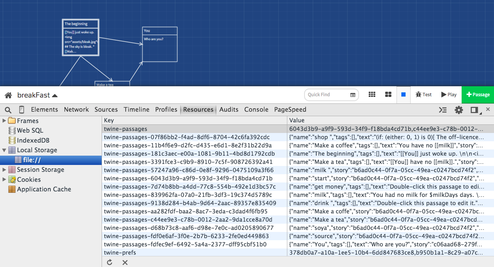
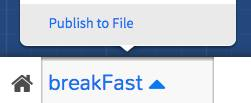
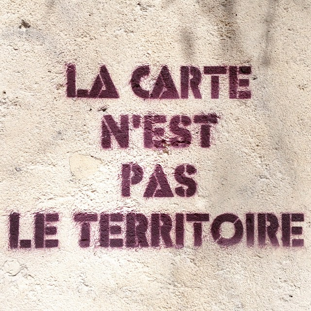
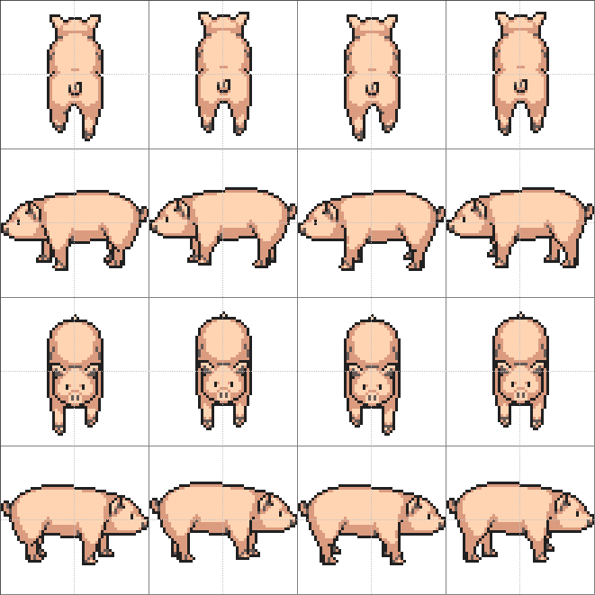
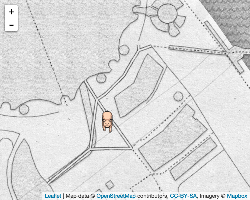

# Session 5

### Today, 14th May 

* [Sort out Git](#sort-out-git)
* [Formative presentations](#formative-presentations)
* [Saving Twine files](#saving-twine-files)
* [Running a local Web server](#running-a-local-web-server)
* [Locative games](#locative-games)

Your [homework](#homework)!


# Sort out Git

### Forking this repository 

1. Log in to [GitHub](https://github.com)
* Go to [github.com/RavensbourneWebMedia/Interactive-Narratives](https://github.com/RavensbourneWebMedia/Interactive-Narratives)
* [**Fork**](https://github.com/RavensbourneWebMedia/Interactive-Narratives#fork-destination-box) it!
* Copy the *HTTPS clone URL* of your new fork, it should look something like `https://github.com/YOUR_NAME/Interactive-Narratives.git`
* Open the [SourceTree](http://www.sourcetreeapp.com/) app
* `File > New / Clone` or `cmd + N`
* `Clone from URL`
	* Paste your *HTTPS clone URL* in the `Source URL`
	* The `Destination Path` should be an *empty* folder on your computer
	* The `Name` can be whatever you want
*	Press `Clone`
*	Once the repository is cloned and downloaded, SourceTree will open up a new window for the repo.

Remember: you will push your work to **your forked repo**, not to the original repo.

### Getting the latest files from the original repo <sup>OPTIONAL</sup> 

1.	Click on `Settings` (the cog icon on the top-right corner)
* `Remotes` > `Add`
	* `Remote name` can be whatever you want, the convention is to call it `upstream`
	* `URL / path` is `https://github.com/RavensbourneWebMedia/Interactive-Narratives.git`, which is the *HTTPS clone URL* of the original repo
* When `upstream` is added to your SourceTree left sidebar, you can right-click on it and choose `Pull from upstream...`
* This will pull (download) all the latest files from the original repository into your fork.


# Formative presentations

### Teams

1. Margot, Matt and Cal
2. Harry, Simeron and Liam 
3. Kim, Burak and Innocent

### [Collective feedback spreadsheet](https://docs.google.com/spreadsheets/d/1Gd9x2G69W2dTos4Ea7YGVcZKW8VzS1zk8Sh3X6bEyV0/edit?usp=sharing)! 

### Checklist

These are some questions that you can use to structure your formative presentation. It's not a strict checklist, pick and mix as your team pleases.

* [ ] How did [modding the verbs](session-01.md#hacking-games-with-verbs) of an existing game influence the *story* that the game tells and the *morals* it embodies?
* [ ] How did the [game-stories you analysed](session-01.md#assignment) convey a narrative through an interactive (and possibly playful) experience? What could you *steal* from them?
* [ ] What can [board games](session-02.md#board-games) teach us about storytelling? Think about *role play* (`are you a knight, a trader, a builder?` etc.) and *social play* (`who are you trading with? who are your allies and enemies?` etc.).. 
* [ ] What are the differences between writing a short story and a [twine](session-02.md#twine)?
* [ ] Can [gaming make a better world](http://www.ted.com/talks/jane_mcgonigal_gaming_can_make_a_better_world?language=en#t-464468)?
* [ ] What elements of your mystery story from last term could be told through a *game* (or *games*)?
* [ ] What are your **two game ideas**? Pitch them to us
* [ ] Would you do that with [Twine](session-02.md#twine), [Phaser](session-03.md#phaser), or both?


# Saving Twine files

Twine saves your work in the browser's [LocalStorage](http://diveintohtml5.info/storage.html).



This means that your *twines* **may be wiped** if you clear your browser's cache! 

To prevent that and safely back your work up:

1. Publish your twines by clicking the `Publish to File` button
	
2. Push your story HTML file plus any linked assets (eg images) to your GitHub repo fork.


If you have images or other media **linked** inside your Twine, make sure that those links are not broken in your published twine. See [here](session-02.md#images).


# Running a *local* Web server

In case you forgot..

**Local development** is the process of building websites, apps or games from the comfort of a *virtual server*, and not needing to be connected to the Internet in order to run the *back-end* of your projects.

Web server applications (pick one):

1. [XAMP](https://www.apachefriends.org) is for Mac, Windows and Linux <sup>RECOMMENDED</sup>
* [MAMP](https://www.mamp.info/en) is for Mac (well, now for Win too)
* [WAMP](http://www.wampserver.com/en/#wampserver-64-bits-php-5-3) is for Windows

> Q: what do you think ***AMP** stand for?

### Your turn

1. Download and install one of the Web server applications above.
* Once it's done, locate the [*root folder*](https://www.google.co.uk/search?q=root+folder) from which your Web server files are served.
* Inside the root folder, create a new folder and name it whatever you please.
* Inside the new folder, create a new HTML document and name it **`index.html`**. Put some content into it (anything you like, for instance `<p>Matteo lives here</p>`)
* Open a Web browser and point it to your *root folder*

	`http://localhost` (XAMPP) or `http://localhost:8888` (MAMP)
* Navigate to your new folder, eg `http://localhost/matteo`
* What do you see?

> [URLs](http://en.wikipedia.org/wiki/Uniform_resource_locator) are just **paths to files** and folders on a server (either on your `localhost` or on some `remote server`).

See [why Phaser needs a local Web server](http://phaser.io/tutorials/getting-started)


# Locative games

Often in videogames you control a character that navigates a **map**.

What is a map? An **abstraction**, like a game.

[](http://en.wikipedia.org/wiki/Map%E2%80%93territory_relation)

How about a **real** map? 

Change the **scale**, take the game **beyond** the screen..


### Ingredients

* [Leaflet](http://leafletjs.com/): an Open-Source JS library for mobile-friendly interactive maps
* Fancy map tiles: [MapBox](https://www.mapbox.com)
* [HTML5 geolocation API](https://developer.mozilla.org/en-US/docs/Web/API/Geolocation/Using_geolocation)
* [Phaser maze](http://phaser.io/tutorials/coding-tips-005)

### Method

<!--Clone the [phaser-coding-tips GitHub repo](https://github.com/photonstorm/phaser-coding-tips).-->

* Find a *top-down* view of your game character on [OpenGameArt](http://opengameart.org/)
	
	For example...
	
	[](http://opengameart.org/content/lpc-style-farm-animals)

* Crop it if necessary (Photoshop + [TexturePacker](https://www.codeandweb.com/texturepacker)) 

	


* New HTML

	```html
	<!DOCTYPE html>
	<html>
		<head>
			<meta charset="utf-8">
			<title>London by pig</title>
		</head>
		<body>
	
			<!-- Phaser game engine -->
			<script src="js/phaser.js"></script>
	
			<!-- our Piggo game logic -->
			<script src="piggo.js"></script>
	
		</body>
	</html>
	```

* New JS file `piggo.js`
	
	```js
	var game 
	game = new Phaser.Game(500, 400, Phaser.AUTO, 'game', {
		preload: preload,
		create: create,
		update: update
	}, true) // true here means that the game background is going to be transparent
	
	
	function preload() {
	}
	
	// set up the game
	function create() {
	}	
	
	// called every single frame
	function update() {
	}
	```

* Preload the pig (and any other assets you may need), *inside* the function `preload`

	```js
	function preload() {
	
		// load a sprite, for the player: a pig
		game.load.spritesheet('piggo', 'assets/pig-walk.png', 55, 55)
	
	}	
	```
* Set up the game, *inside* the function `create`

	```js
	function create() {

		// give the game canvas an ID so that we can style it with CSS
		game.canvas.id = 'game'
	
		// give the game world some physics rules
		game.physics.startSystem(Phaser.Physics.ARCADE)
	
		// set the game world boundaries
		game.world.setBounds(0, 0, 2000, game.height)
	
		// create the player
		player = game.add.sprite(0, 0, 'piggo')
		
		// centre the player in the game "stage"
		player.x = (game.width - player.width) / 2
		player.y = (game.height - player.height) / 2
		
		// enable physics for the player
		game.physics.arcade.enable(player)
		player.body.collideWorldBounds = true // so that player doesn't fall off the screen
	
		// create pig walking animations
		player.animations.add('up', [0,1,2,3], 10, true)
		player.animations.add('left', [4,5,6,7], 10, true)
		player.animations.add('right', [12,13,14,15], 10, true)
		player.animations.add('down', [8,9,10,11], 10, true)
	
		// create the controls
		cursors = game.input.keyboard.createCursorKeys()
	
	}	
	```

* Make the pig **animate** in four directions, *inside* the function `update`

	```js
	function update() {

		// make the pig animate in four directions
		if (cursors.right.isDown) {
			player.animations.play('right')
		} else if (cursors.left.isDown) {
			player.animations.play('left')
		} else if (cursors.up.isDown) {
			player.animations.play('up')
		} else if (cursors.down.isDown) {
			player.animations.play('down')
		} else {
			player.animations.stop()
		}
	
	}
	```

* Make the pig **move** in four directions, *inside* the function `update` (don't delete the code to *animate* the pig from above)

	```js
	var playerSpeed = 53
	
	function update() {
		
		// stop the pig by default
		player.body.velocity.x = 0
		player.body.velocity.y = 0
	
		// make the pig animate and move in four directions
		if (cursors.right.isDown) {
			player.body.velocity.x = playerSpeed
		} else if (cursors.left.isDown) {
			player.body.velocity.x = -playerSpeed
		} else if (cursors.up.isDown) {
			player.body.velocity.y = -playerSpeed
		} else if (cursors.down.isDown) {
			player.body.velocity.y = playerSpeed
		}
		
	}
	```	
	
* Get the camera to **follow** the pig, *inside* the function `create`	

	```js
	function create() {
		// 
		game.camera.follow(player)
	}
	```	

* Add a [Leaflet](http://leafletjs.com) map underneath (download the latest stable version of Leaflet and then paste the whole `leaflet` folder in the same folder as `index.html`)
	
	Inside the `head` of `index.html`
	```html
	<link rel="stylesheet" href="leaflet/leaflet.css">	
	<style>
		#map,
		#game 
		{
			width: 500px;
			height: 400px;

			position: absolute;
			top: 0;
			left: 0;
		}
	</style>
	```
	
	Inside the `body` of `index.html`
	```html
	<div id="map"></div>
	
	<script src="leaflet/leaflet.js"></script>
	<script src="piggo-leaflet.js"></script>
	```
	
	New JS file `piggo-leaflet.js`
	```js
	// "global" variables, accessible outside of this JS file
	var map
	
	// create the map
	
	var raveCoordinates = [51.501499, 0.005374]
	var initialZoom = 17
	
	var mapOptions = 
	{
		attribution: 'Map data &copy; <a href="http://openstreetmap.org">OpenStreetMap</a> contributors, <a href="http://creativecommons.org/licenses/by-sa/2.0/">CC-BY-SA</a>, Imagery © <a href="http://mapbox.com">Mapbox</a>',
		maxZoom: 18
		// for more options see http://leafletjs.com/reference.html#map-options
	}
	
	// get your tiles at https://www.mapbox.com
	var mapTiles = '//{s}.tiles.mapbox.com/v3/baddeo.map-ad3lxx2v/{z}/{x}/{y}.png'
	
	map = L.map('map').setView(raveCoordinates, initialZoom)
	
	L.tileLayer(mapTiles, mapOptions).addTo(map)
	```
		
* Make the pig *talk* to the map
	
	*Inside* the function `update`, add the following lines to [dispatch an event](http://www.slideshare.net/MsWillcox/event-driven-programming-amazeballs) (ie, *send a message*) that contains data about the current position of the game camera
	```js
	function update() {
		
		var data = { x: game.camera.x, y:game.camera.y }
		document.dispatchEvent( new CustomEvent( 'Camera', { detail: data } ) )
	}
	```	
	
	In `piggo-leaflet.js`
	```js
	
	// we need to store the position of the game camera
	// to pan the map around
	var cameraPosition = 
	{
		x: 0,
		y: 0
	}
	
	// when we receive the 'Camera' event..
	// pan the map around
	document.addEventListener('Camera', function(event)
	{
		// console.log('Camera', event.detail)

		var newCameraPosition = event.detail

		// we only pan the map if the camera has moved
		// we check that by comparing the previous positions to the current positions
		if (cameraPosition.x !== newCameraPosition.x 
		 || cameraPosition.y !== newCameraPosition.y)
		{
			// work out the difference
			// how much has the camera actually moved since last update?
			var difference = 
			{
				x: newCameraPosition.x - cameraPosition.x,
				y: newCameraPosition.y - cameraPosition.y 
			}

			// move by that difference
			map.panBy([difference.x, difference.y], {animate:false})

			// update cameraPosition
			cameraPosition = newCameraPosition
		}
	})
	```

[](../resources/phasermap)

### Next steps

* Can you get the pig to follow you as you physically move around? 
* Can you simulate encounters with other animals, people or objects?


### Resources

* [How do Web maps work?](https://www.mapbox.com/guides/how-web-maps-work/)
* [JavaScript Custom Events](http://davidwalsh.name/customevent)
* [How to scale your HTML5 endless runner game to play it on mobile devices](http://www.emanueleferonato.com/2015/03/25/quick-tip-how-to-scale-your-html5-endless-runner-game-to-play-it-on-mobile-devices/)
* [Texture Packer](https://www.codeandweb.com/texturepacker)

### Inspirations

* [Hear us Here](http://www.hearushereapp.com)
* [Zombies Run](https://www.zombiesrungame.com/)


# Homework

Continue working on your chosen game ideas and start developing the game prototypes you are going to present at the summative in a month.

<!--
Using [Phaser](http://phaser.io/) *remix* an [exploration-based game](http://en.wikipedia.org/wiki/Adventure_game) so that it tells **your** team story through space. 

Your game may have one or more of the following features:

* Based in the Greenwich Peninsula (at any point in history)
* The map *is* the territory (to explore)
* Autobiographical (not necessarily a realistic or contemporary setting)
* Travelling in time
* A soundscape that reveals clues
-->